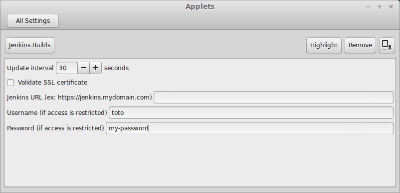

# cinnamon-jenkins-applet

A Cinnamon applet that shows jenkins jobs.

Once you've installed it (in your `~/.local/share/cinnamon/applets`) you can right click `Configure...` on the applet and fill
in the jenkins URL.

